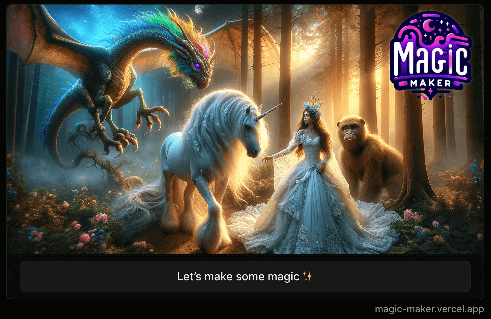

# Magic Maker



## 🌈 Weave a magic fairy tale in a Farcaster Frame

- 🏰 Guide your hero through an immersive choose-your-own-adventure experience
- ✨ Watch as the AI crafts unique story segments based on your choices
- 📜 Enjoy a satisfying conclusion to your fairy tale journey
- 🖼️ Option to mint your completed story as an NFT on the Farcaster blockchain

## 🔧 Installation

1. Clone the repository:

```
git clone https://github.com/velvet-shark/magic-maker.git
```

2. Navigate to the project directory:

```
cd magic-maker
```

3. Install the dependencies:

```
npm install
```

4. Start the development server:

```
npm run dev
```

5. Rename `.env.example` to `.env` and add Airstack API key. You can learn how to get it here: [🗝️Get API Key](https://docs.airstack.xyz/airstack-docs-and-faqs/get-started/get-api-key)

6. Open your browser and visit http://localhost:5173/dev to begin your fairy tale adventure!

## 🎨 Technologies Used

- ⚛️ React.js for building the user interface
- 🐸 Airstack Frog Recipes
- 🤖 Anthropic Claude API (Sonnet model) for generating story segments
- 🔵 Solidiy smart contract on Base for fairy tale storage
- 🌐 Farcaster Frames API for storing fairy tales in a smart contract or as an NFT (unfinished)

## 🎯 Future plans

- 🖼️ Generate a fairy tale-style picture after each story segment, relevant to that segment, to increase engagement and interest
- ✍️ Let users choose the protagonist's name
- 🍬 Option to store the full story onchain, forever (with full text and images). `FairyTaleStorage` smart contract is already deployed on Base for this purpose: https://basescan.org/address/0xD7c7FAc1973Ed352880ffb9035561dEC7281Bb8f

## 🤝 Contributing

I welcome contributions and any suggestions to improve this magic experience! If you'd like to contribute to Magic Maker, please follow these steps:

1. Fork the repository
2. Create a new branch (git checkout -b feature/your-feature)
3. Commit your changes (git commit -am 'Add a new feature')
4. Push to the branch (git push origin feature/your-feature)
5. Open a Pull Request

## 📄 License

This project is licensed under the MIT License. See the LICENSE file for details.

Now, embark on your very own fairy tale adventure with EnchantedInk! 🧙‍♂️✨
